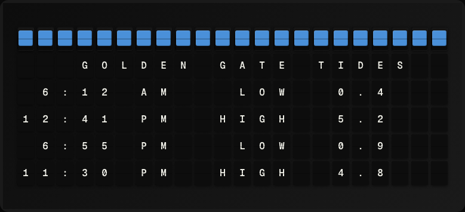

# Tide Times Plugin

Display today's high and low tide predictions for any NOAA tide gauge station.



**→ [Setup Guide](./docs/SETUP.md)**

## Overview

The Tide Times plugin queries the NOAA Tides and Currents API for tide predictions at a user-specified station ID. It shows the next high and low tide times and heights. No API key required.

## Template Variables

| Variable | Description | Example |
|---|---|---|
| `tide_times.next_type` | Next tide type (High or Low) | `High` |
| `tide_times.next_time` | Time of the next tide | `2:45 PM` |
| `tide_times.next_height` | Height of the next tide (ft or m) | `5.4 ft` |
| `tide_times.station_name` | Station name | `San Francisco, CA` |

## Example Templates

```
TIDE TIMES
{{tide_times.station_name}}
Next: {{tide_times.next_type}}
Time: {{tide_times.next_time}}
Height: {{tide_times.next_height}}

```

## Configuration

| Setting | Name | Description | Required |
|---|---|---|---|
| `station_id` | Station ID | NOAA tide gauge station ID (e.g. 9414290 for San Francisco). | Yes |
| `units` | Units | Measurement units. | No |

## Features

- NOAA tides and currents API
- Configurable station ID
- English and metric unit support
- Next high/low tide time and height
- No API key required

## Author

FiestaBoard Team
